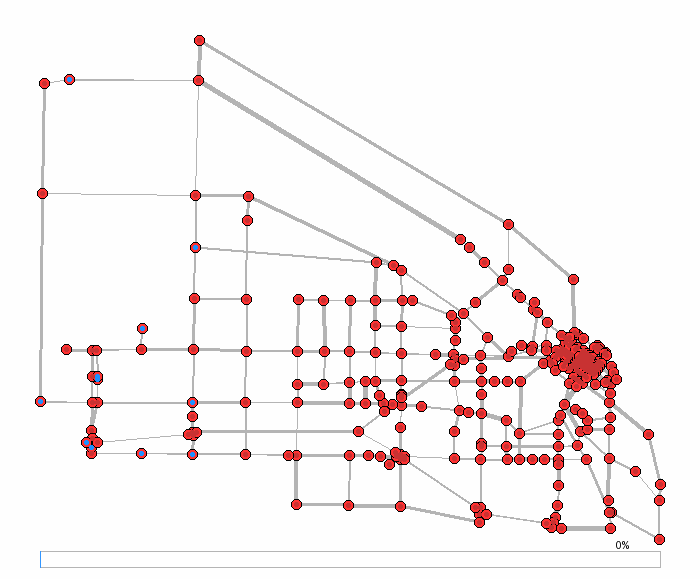
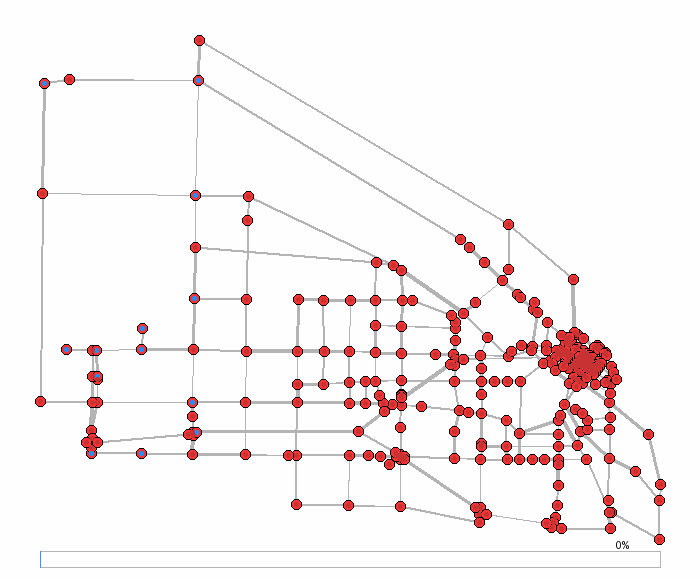
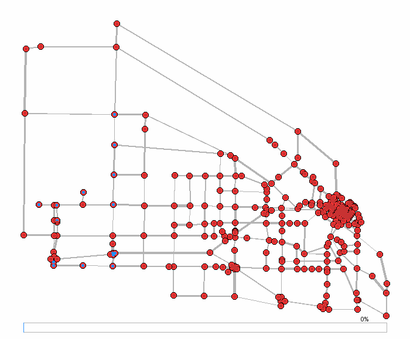
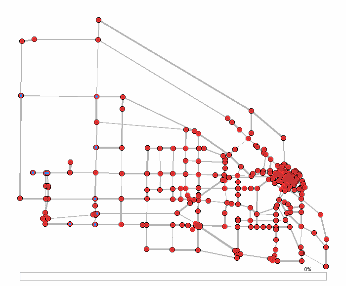
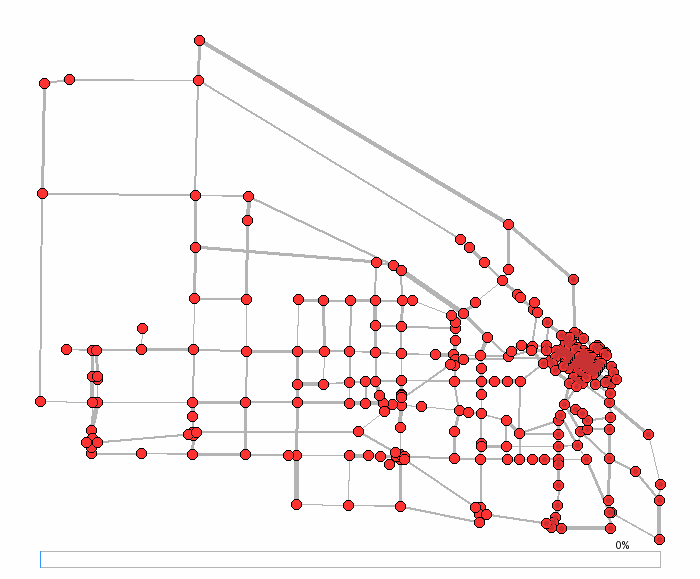

# Evacuation Planning Research (Public Artifact)

This site presents a cleaned, buildable artifact of graduate research on
evolving evacuation strategies for urban networks. It includes a C++ simulator
with a small scenario language (SLang), and a curated set of animations.

If you’re looking for the code and details, the repository root contains the
full source and LaTeX materials.

## Paper

- View the paper: [paper.pdf](./paper.pdf)

## Demos (Boise)

Population series (60k variants):










Capacity and safe-to-danger variants:





## Build & Run

Build the simulator (Bazel, C++11, Flex/Bison invoked via Bazel):

```bash
bazel build //Simulation:evac
```

Run on a provided scenario (writes `outputs/<CityName>Final.txt`):

```bash
bazel run //Simulation:evac_run -- Simulation/slang/highway.slang
```

Hermetic demo artifacts (preferred for presentation; Pillow required for GIFs):

```bash
# Drawable only
bazel build //Simulation:drawable_minigrid
bazel build //Simulation:drawable_highway

# Animated GIFs (pip3 install --user Pillow)
bazel build //Simulation:gif_minigrid
bazel build //Simulation:gif_highway
```

## Notes

- Historical figures under `Simulation/results/` and `Paper/` include some PNGs
  that are not easily reproducible; they are preserved as-is for reference.
- The simulator code targets C++11 and builds with Bazel + Bzlmod.
